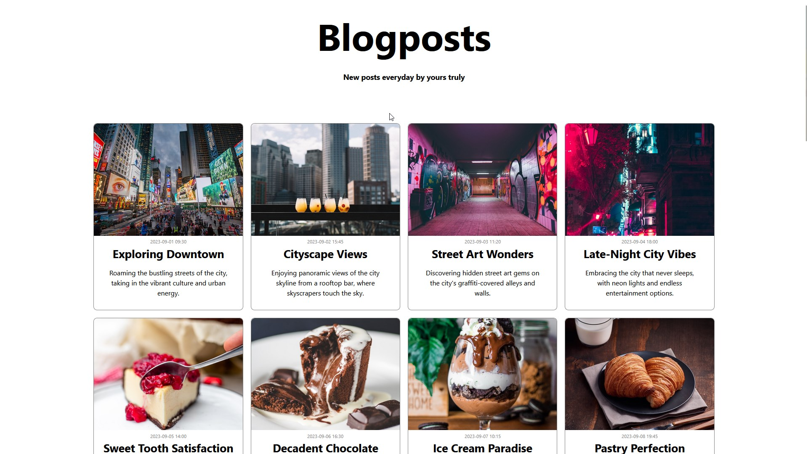

# Framework

Task - Framework:
Repository for my work on this weeks task.
We are in the early stages of learning React. 
And we are using React together with Vite to complete a small task that let's us use what we have learned this week.

We were tasked with creating a site that would display a list with data collected from an array.
I decided to make a blog like site for this assignment. So I asked ChatGPT to generate 24 posts for me with template information like titles, short descriptions and a timestamp.
As for the images, I used unsplash.com to find images that would suit these posts.

And this task had certain requirements.
One requirement was to make an component that uses properties. | In my task I created properties for the post's image, timestamp, title and descriptions.
One requirement was to make an component that uses child properties. | I chose to make a layout component that utilizes child properties.
One requirement was to generate a list containing data. | I decided to create a blog page which generates posts from data that's collected from an array I made.
One requirement was to have an example where we use a static file like a logo or an image file. | I completed this requirement by adding static images to the posts.   

